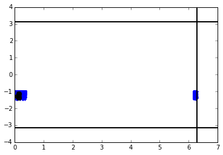
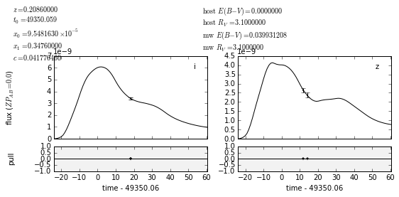
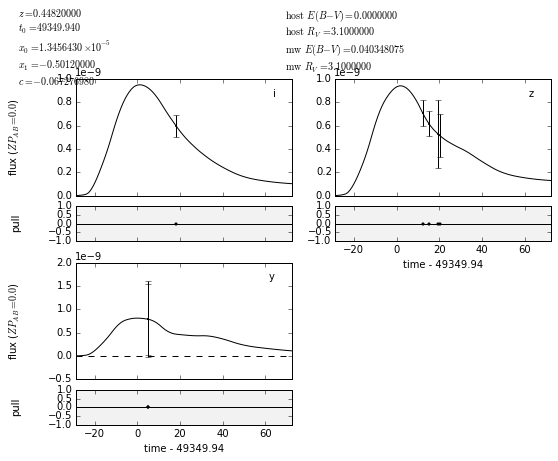
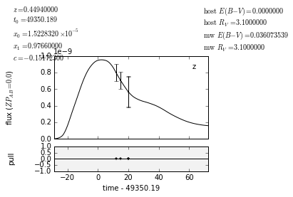
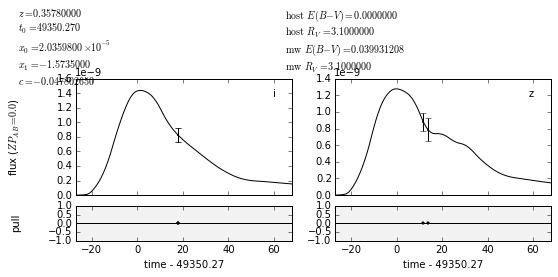
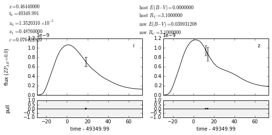
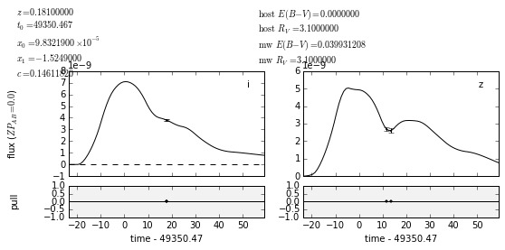
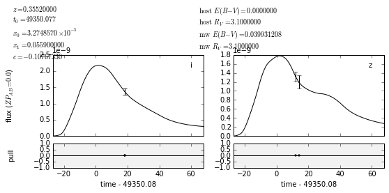
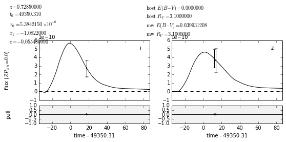

Example notebook trying to emulate FindLCsFromOpSim.ipynb which seems to be corrupted


```python
import numpy as np
%matplotlib inline
import matplotlib.pyplot as plt
import os
import sqlite3
```


```python
from lsst.sims.catUtils.mixins import CosmologyMixin
from lsst.sims.utils import ObservationMetaData
from lsst.sims.catUtils.utils import ObservationMetaDataGenerator
from lsst.sims.catalogs.generation.db import CatalogDBObject
from lsst.sims.catalogs.measures.instance import InstanceCatalog
import eups
```

    /usr/local/manual/anaconda/lib/python2.7/site-packages/IPython/kernel/__init__.py:13: ShimWarning: The `IPython.kernel` package has been deprecated. You should import from ipykernel or jupyter_client instead.
      "You should import from ipykernel or jupyter_client instead.", ShimWarning)
    Duplicate object type id 25 specified: 
    Output object ids may not be unique.
    This may not be a problem if you do not want globally unique id values
    Duplicate object type id 40 specified: 
    Output object ids may not be unique.
    This may not be a problem if you do not want globally unique id values
    Duplicate object type id 40 specified: 
    Output object ids may not be unique.
    This may not be a problem if you do not want globally unique id values
    Duplicate object type id 40 specified: 
    Output object ids may not be unique.
    This may not be a problem if you do not want globally unique id values
    Duplicate object type id 40 specified: 
    Output object ids may not be unique.
    This may not be a problem if you do not want globally unique id values


```python
from lsst.sims.catUtils.mixins import SNIaCatalog
from lsst.sims.catUtils.mixins import SNObject
```


```python
def samplePatchOnSphere(phi, theta, delta, size):
    '''
    (not) Uniformly distributes samples on a spherical patch between phi \pm delta,
    and theta \pm delta.
    
    will modify to fix this later
    Parameters
    ----------
    phi: float, mandatory, radians
        center of the spherical patch in ra with range 
    theta: float, mandatory, radians
    delta: float, mandatory, radians
    size: int, mandatory
        number of samples
    '''
    u = np.random.uniform(size=size)
    v = np.random.uniform(size=size)

    # phivals = delta * (2. * u - 1) + phi
    phivals = 2. * delta* u + (phi - delta )
    phivals = np.where ( phivals >= 0., phivals, phivals + 2. * np.pi)
    
    # use conventions in spherical coordinates
    theta = np.pi/2.0 - theta
    # thetavals = 2. * delta* v + (theta - delta )
    # thetavals = np.where ( thetavals < np.pi , thetavals, thetavals - np.pi)
    # thetavals = np.where ( thetavals > - np.pi , thetavals, thetavals + np.pi)
    
    
    thetamax = theta + delta
    thetamin = theta - delta
    # CDF is cos(thetamin) - cos(theta) / cos(thetamin) - cos(thetamax)
    a = np.cos(thetamin) - np.cos(thetamax)
    thetavals = np.arccos(-v * a + np.cos(thetamin))
    # Get back to -pi/2 to pi/2 range of decs
    thetavals = np.pi/2.0 - thetavals 
    return phivals, thetavals
```


```python
def cleanDB(dbname, verbose=True):
    '''
    Deletes the database dbname from the disk.
    Parameters
    ----------
    dbname: string, mandatory
        name (abs path) of the database to be deleted
    verbose: Bool, optional, defaults to True

    '''

    if os.path.exists(dbname):
        if verbose:
            print "deleting database ", dbname
        os.unlink(dbname)
    else:
        if verbose:
            print 'database ', dbname, ' does not exist'
```


```python
def sample_obsmetadata(obsmetadata, size=1):
    '''
    Sample a square patch on the sphere overlapping obsmetadata
    field of view by picking the area enclosed in
    obsmetadata.unrefractedRA \pm obsmetadata.boundLength
    obsmetadata.unrefractedDec \pm obsmetadata.boundLength

    Parameters
    ----------
    obsmetadata: instance of
        `sims.catalogs.generation.db.ObservationMetaData`

    size: integer, optional, defaults to 1
        number of samples


    Returns
    -------

    tuple of ravals, decvalues
    '''
    mydict = obsmetadata.summary
    phi = np.radians(mydict['unrefractedRA'])
    theta = np.radians(mydict['unrefractedDec'])
    equalrange = np.radians(mydict['boundLength'])
    ravals, thetavals = samplePatchOnSphere(phi=phi, theta=theta, delta=equalrange, size=size)
    return ravals, thetavals
```


```python
def _createFakeGalaxyDB(dbname, ObsMetaData, size=10000, seed=1):
    '''
    Create a local sqlite galaxy database having filename dbname with variables
    id, raJ2000, decJ2000 and redshift, having number of rows =size, and having
    overlap with ObsMetaData.
    '''
    cleanDB(dbname)
    conn = sqlite3.connect(dbname)
    curs = conn.cursor()
    curs.execute('CREATE TABLE if not exists gals (id INT, raJ2000 FLOAT,\
                  decJ2000 FLOAT, redshift FLOAT)')

    np.random.seed(seed)
    samps = sample_obsmetadata(ObsMetaData, size=size)

    for count in range(size):
        id = 1000000 + count

        # Main Database should have values in degrees
        ra = np.degrees(samps[0][count])
        dec = np.degrees(samps[1][count])
        redshift = np.random.uniform()
        row = tuple([id, ra, dec, redshift])
        exec_str = insertfromdata(tablename='gals', records=row,
                                     multiple=False)
        curs.execute(exec_str, row)

    conn.commit()
    conn.close()
    return samps
```


```python
def insertfromdata(tablename, records, multiple=True):
    """
    construct string to insert multiple records into sqlite3 database
    args:
        tablename: str, mandatory
            Name of table in the database.
        records: set of records
        multiple:
    returns:
    """
    if multiple:
        lst = records[0]
    else:
        lst = records
    s = 'INSERT INTO ' + str(tablename) + ' VALUES '
    s += "( " + ", ".join(["?"]*len(lst)) + ")"
    return s
```


```python
class myGalaxyCatalog(CatalogDBObject):
    '''
    Create a like CatalogDBObject connecting to a local sqlite database
    '''

    objid = 'mytestgals'
    tableid = 'gals'
    idColKey = 'id'
    objectTypeId = 0
    appendint = 10000
    database = 'testdata/galcat.db'
    # dbAddress = './testData/galcat.db'
    raColName = 'raJ2000'
    decColName = 'decJ2000'
    driver = 'sqlite'

    # columns required to convert the ra, dec values in degrees
    # to radians again
    columns = [('id', 'id', int),
               ('raJ2000','raJ2000 * PI()/ 180. '),
               ('decJ2000','decJ2000 * PI()/ 180.'),
               ('redshift', 'redshift')]
```

## Now create a fake galaxy table


```python
obsMetaDataforCat = ObservationMetaData(boundType='circle',
                                          boundLength=np.degrees(0.25),
                                          unrefractedRA=np.degrees(0.13),
                                          unrefractedDec=np.degrees(-1.2),
                                          bandpassName=['r'],
                                          mjd=49350.)
```


```python
sample_obsmetadata(obsMetaDataforCat, size=1)
```


    (array([ 0.09263515]), array([-1.13865032]))


```python
obsMetaDataforCat.boundLength
```


    14.323944878270581


```python
obsMetaDataforCat._boundLength
```


    0.25


```python
if not os.path.exists('testSNData'):
    os.makedirs('testSNData')
testdbName = 'testSNData/galcat.db'
vals = _createFakeGalaxyDB(dbname=testdbName,
                    ObsMetaData=obsMetaDataforCat,
                    size=1000000,
                    seed=1)
```

    deleting database  testSNData/galcat.db


```python
vals
```


    (array([ 0.088511  ,  0.24016225,  6.16324249, ...,  0.12661688,
             6.21759016,  0.06512591]),
     array([-0.99399571, -1.21610453, -1.15133414, ..., -1.02888506,
            -1.33583417, -1.04711557]))


```python

plt.plot(vals[0][:1000], vals[1][:1000], '.')
plt.axvline(2. * np.pi, color='k', lw=2.)
plt.axvline(0., color='k', lw=2.)
plt.axhline(np.pi, color='k', lw=2.)
plt.axhline(-np.pi, color='k', lw=2.)
plt.plot([0.13], [-1.2], 'rs', markersize=8)
```


    [<matplotlib.lines.Line2D at 0x111eb4f90>]


```python
galDB = myGalaxyCatalog(database=testdbName)
```


```python
class galCopy(InstanceCatalog):
    column_outputs = ['id', 'raJ2000', 'decJ2000', 'redshift']
    override_formats = {'raJ2000': '%8e', 'decJ2000': '%8e'}
```


```python
galphot = galCopy(db_obj=galDB, obs_metadata=obsMetaDataforCat)

```


```python
galphot.write_catalog('gals.dat')
```


```python
!wc -l gals.dat
```

      742765 gals.dat


```python
!head gals.dat
```

    #id, raJ2000, decJ2000, redshift
    1000000, 8.851100e-02, -9.939957e-01, 0.0376
    1000001, 2.401622e-01, -1.216105e+00, 0.7608
    1000003, 3.116629e-02, -1.009110e+00, 0.1566
    1000007, 5.278036e-02, -9.771580e-01, 0.3991
    1000008, 7.838374e-02, -1.024724e+00, 0.7685
    1000009, 1.494084e-01, -9.881543e-01, 0.9084
    1000010, 8.959726e-02, -1.070042e+00, 0.5480
    1000011, 2.226098e-01, -1.132653e+00, 0.8986
    1000013, 3.190587e-01, -1.084762e+00, 0.0921


## Building Light Curves from Instance Catalogs


We would like to create a number of supernova instance catalogs and then build the light curves from the catalogs. To do this correctly, we would like to use the observation_metadata associated with a number of conscutive OpSIM pointings.


```python
opsimPath = os.path.join(eups.productDir('sims_data'),'OpSimData')
opsimDB = os.path.join(opsimPath,'opsimblitz1_1133_sqlite.db')

# from Tuscon AHM notebook from Scott
# This OPSIM DB is provided in sims_data. This creates a list of opsim pointings
# that I have checked. This is a tuned notebook
generator = ObservationMetaDataGenerator() #database = opsimPath, driver='sqlite')
obsMetaDataResults = generator.getObservationMetaData(limit=100,
                                                      fieldRA=(5.0, 8.0), 
                                                      fieldDec=(-85.,-60.),
                                                      expMJD=(49300., 49400.),
                                                      boundLength=0.015,
                                                      boundType='circle')

```


```python
# How many pointings do we have? 
print (len(obsMetaDataResults))
```

    15


```python
def coords(x): 
    return np.radians(x.summary['unrefractedRA']), np.radians(x.summary['unrefractedDec'])
```


```python
v = zip(*map(coords, obsMetaDataResults))
```


```python
plt.plot(v[0], v[1], 'ko', markersize=4)
plt.plot(vals[0][:1000], vals[1][:1000], '.')
plt.axvline(2. * np.pi, color='k', lw=2.)
plt.axvline(0., color='k', lw=2.)
plt.axhline(np.pi, color='k', lw=2.)
plt.axhline(-np.pi, color='k', lw=2.)
plt.plot(v[0], v[1], 'ko', markersize=8)
```


    [<matplotlib.lines.Line2D at 0x11aa29210>]





```python
if not os.path.exists('testSNData/NewLightCurves'): 
    os.makedirs('testSNdata/NewLightCurves')
```


```python
column_outputs=['flux_u', 'flux_g', 'flux_r', 'flux_i', 'flux_z', 'flux_y',
                'mag_u', 'mag_g', 'mag_r', 'mag_i', 'mag_z', 'mag_y']
```


```python
catalog = SNIaCatalog(db_obj=galDB, 
                            obs_metadata=obsMetaDataResults[0], 
                            column_outputs=['t0', 'flux_u', 'flux_g', 'flux_r', 'flux_i', 'flux_z',
                                            'flux_y', 'mag_u', 'mag_g', 'mag_r', 'mag_i', 
                                            'mag_z', 'mag_y', 'adu_u', 'adu_g', 'adu_r',
                                            'adu_i', 'adu_z', 'adu_y','mwebv'])
```


```python
catalog.suppressDimSN = True
```


```python
catalog.midSurveyTime=catalog.mjdobs - 20.
catalog.averageRate =1.
```


```python
print (catalog.mjdobs)
```

    49362.070248


```python
print (catalog.maxTimeSNVisible)
```

    100.0


```python
catalog.write_catalog('testSNData/NewLightCurves/FullCatalog.dat')
```

    /Users/rbiswas/src/LSST/sims_catutils/python/lsst/sims/catUtils/mixins/snObject.py:649: RuntimeWarning: invalid value encountered in log10
      return -2.5 * np.log10(f)


```python
!cat testSNData/NewLightCurves/FullCatalog.dat
```

    #snid, snra, sndec, z, t0, c, x1, x0, flux_u, flux_g, flux_r, flux_i, flux_z, flux_y, mag_u, mag_g, mag_r, mag_i, mag_z, mag_y, adu_u, adu_g, adu_r, adu_i, adu_z, adu_y, mwebv
    1194063, 9.807749e-02, -1.279044e+00, 0.3578, 49342.3398, -4.780265e-02, -1.5735, 2.035980e-05, -2.326344e-11, 1.322701e-10, 4.803133e-10, 7.703456e-10, 7.340477e-10, 4.916932e-10, nan, 24.6963, 23.2962, 22.7833, 22.8357, 23.2708, 0.0000, 0.0000, 0.0000, 0.0000, 0.0000, 0.0000, 0.0399
    1202620, 9.822037e-02, -1.279374e+00, 0.3552, 49342.1473, -1.076733e-01, 0.0559, 3.274857e-05, -2.594385e-12, 3.867345e-10, 9.501096e-10, 1.271056e-09, 1.025563e-09, 6.346549e-10, nan, 23.5315, 22.5556, 22.2396, 22.4726, 22.9937, 0.0000, 0.0000, 0.0000, 0.0000, 0.0000, 0.0000, 0.0399
    1456605, 9.746749e-02, -1.279057e+00, 0.7285, 49342.3804, -5.548099e-02, -1.0822, 5.384215e-06, 1.122736e-12, 1.059104e-11, 1.039187e-10, 2.407267e-10, 2.978060e-10, 3.130018e-10, 29.8743, 27.4377, 24.9583, 24.0462, 23.8152, 23.7611, 0.0000, 0.0000, 0.0000, 0.0000, 0.0000, 0.0000, 0.0399
    1812900, 9.864307e-02, -1.279292e+00, 0.2086, 49342.1296, 4.177646e-02, 0.3476, 9.548163e-05, 1.158895e-10, 1.316927e-09, 3.094136e-09, 3.268146e-09, 2.041532e-09, 1.823679e-09, 24.8399, 22.2011, 21.2737, 21.2142, 21.7251, 21.8476, 0.0000, 0.0000, 0.0000, 0.0000, 0.0000, 0.0000, 0.0399
    1956535, 9.875172e-02, -1.279203e+00, 0.1810, 49342.5375, 1.461182e-01, -1.5249, 9.832190e-05, 7.704023e-11, 9.209585e-10, 3.006094e-09, 3.640447e-09, 3.167919e-09, 2.373858e-09, 25.2832, 22.5894, 21.3050, 21.0971, 21.2481, 21.5614, 0.0000, 0.0000, 0.0000, 0.0000, 0.0000, 0.0000, 0.0399
    1972436, 9.750733e-02, -1.279303e+00, 0.4644, 49342.0616, 7.642282e-02, 0.4876, 1.352031e-05, 2.054846e-12, 8.533415e-11, 4.717782e-10, 6.595846e-10, 6.719016e-10, 5.982134e-10, 29.2181, 25.1722, 23.3157, 22.9518, 22.9317, 23.0579, 0.0000, 0.0000, 0.0000, 0.0000, 0.0000, 0.0000, 0.0399


```python
newcatalog = SNIaCatalog(db_obj=galDB, 
                         obs_metadata=obsMetaDataResults[0], 
                         column_outputs=['t0', 'time', 'band', 'flux', 'flux_err', 'mag', 'mag_err', 'mwebv'])
```


```python
newcatalog.midSurveyTime=catalog.mjdobs - 20.
newcatalog.averageRate =1.
```


```python
newcatalog.write_catalog('testSNData/NewLightCurves/FullCatalog.dat')
```


```python
!pwd
```

    /Users/rbiswas/src/LSST/sims_catUtils/examples


```python
!cat testSNData/NewLightCurves/FullCatalog.dat
```

    #snid, snra, sndec, z, t0, c, x1, x0, time, band, flux, flux_err, mag, mag_err, mwebv
    1194063, 9.807749e-02, -1.279044e+00, 0.3578, 49342.3398, -4.780265e-02, -1.5735, 2.035980e-05, 49362.0702, z, 7.340477e-10, 1.093234e-10, 22.8357, 1.508190e-01, 0.0399
    1202620, 9.822037e-02, -1.279374e+00, 0.3552, 49342.1473, -1.076733e-01, 0.0559, 3.274857e-05, 49362.0702, z, 1.025563e-09, 1.097130e-10, 22.4726, 1.104609e-01, 0.0399
    1456605, 9.746749e-02, -1.279057e+00, 0.7285, 49342.3804, -5.548099e-02, -1.0822, 5.384215e-06, 49362.0702, z, 2.978060e-10, 1.087378e-10, 23.8152, 3.379717e-01, 0.0399
    1812900, 9.864307e-02, -1.279292e+00, 0.2086, 49342.1296, 4.177646e-02, 0.3476, 9.548163e-05, 49362.0702, z, 2.041532e-09, 1.110600e-10, 21.7251, 5.773077e-02, 0.0399
    1956535, 9.875172e-02, -1.279203e+00, 0.1810, 49342.5375, 1.461182e-01, -1.5249, 9.832190e-05, 49362.0702, z, 3.167919e-09, 1.125346e-10, 21.2481, 3.822799e-02, 0.0399
    1972436, 9.750733e-02, -1.279303e+00, 0.4644, 49342.0616, 7.642282e-02, 0.4876, 1.352031e-05, 49362.0702, z, 6.719016e-10, 1.092402e-10, 22.9317, 1.636369e-01, 0.0399


```python
def ourWriteCatalog(obsMetaDataResults):
    fnameList = []
    for obsind, obsMetaData in enumerate(obsMetaDataResults):
        newcatalog = SNIaCatalog(db_obj=galDB, 
                                 obs_metadata=obsMetaData, 
                                 column_outputs=['t0', 'cosmologicalDistanceModulus', 'mwebv','time', 'band', 'flux', 'flux_err', 'mag', 'mag_err'])
        newcatalog.midSurveyTime=49350
        newcatalog.averageRate =1.
        newcatalog.suppressDimSN = True
        fname =  'testSNData/NewLightCurves/SNCatalog_' + "{0:d}".format(obsind)
        newcatalog.write_catalog(fname)
        fnameList.append(fname)
    return fnameList
```


```python
fnamelist = ourWriteCatalog(obsMetaDataResults)
```


```python
print (fnamelist)
```

    ['testSNData/NewLightCurves/SNCatalog_0', 'testSNData/NewLightCurves/SNCatalog_1', 'testSNData/NewLightCurves/SNCatalog_2', 'testSNData/NewLightCurves/SNCatalog_3', 'testSNData/NewLightCurves/SNCatalog_4', 'testSNData/NewLightCurves/SNCatalog_5', 'testSNData/NewLightCurves/SNCatalog_6', 'testSNData/NewLightCurves/SNCatalog_7', 'testSNData/NewLightCurves/SNCatalog_8', 'testSNData/NewLightCurves/SNCatalog_9', 'testSNData/NewLightCurves/SNCatalog_10', 'testSNData/NewLightCurves/SNCatalog_11', 'testSNData/NewLightCurves/SNCatalog_12', 'testSNData/NewLightCurves/SNCatalog_13', 'testSNData/NewLightCurves/SNCatalog_14']


```python
import pandas as pd
from astropy.table import Table
import sncosmo
```


```python
dfs = []
_ = map(lambda x: dfs.append(pd.read_csv(x, index_col=None, sep=', ')), fnamelist)
all_lcs = pd.concat(dfs)
all_lcs.rename(columns={'#snid': 'snid'}, inplace=True)
lcs = all_lcs.groupby('snid')
```

    /usr/local/manual/anaconda/lib/python2.7/site-packages/pandas/io/parsers.py:644: ParserWarning: Falling back to the 'python' engine because the 'c' engine does not support regex separators; you can avoid this warning by specifying engine='python'.
      ParserWarning)


```python
throughputsdir = os.getenv('THROUGHPUTS_DIR')

from astropy.units import Unit
bandPassList = ['u', 'g', 'r', 'i', 'z', 'y']
banddir = os.path.join(os.getenv('THROUGHPUTS_DIR'), 'baseline')

for band in bandPassList:

    # setup sncosmo bandpasses
    bandfname = banddir + "/total_" + band + '.dat'


    # register the LSST bands to the SNCosmo registry
    # Not needed for LSST, but useful to compare independent codes
    # Usually the next two lines can be merged,
    # but there is an astropy bug currently which affects only OSX.
    numpyband = np.loadtxt(bandfname)
    sncosmoband = sncosmo.Bandpass(wave=numpyband[:, 0],
                                   trans=numpyband[:, 1],
                                   wave_unit=Unit('nm'),
                                   name=band)
    sncosmo.registry.register(sncosmoband, force=True)
```


```python
from lsst.sims.photUtils import Bandpass
from lsst.sims.photUtils import BandpassDict

bandpassnames = ['u', 'g', 'r', 'i', 'z', 'y']
LSST_BandPass = BandpassDict.loadTotalBandpassesFromFiles()
```


```python
def SNCosmoModel(lc):
    f = np.unique(np.asarray(lc[['z', 'c', 'x1', 't0', 'x0','snra', 'sndec']]))
    SNO = SNObject(ra=f['snra'][0], dec=f['sndec'][0])
    SNO.set(z=f['z'][0], c=f['c'][0], x1=f['x1'][0], t0=f['t0'][0], x0=f['x0'][0])
    sn = SNO.equivalentSNCosmoModel()
    return sn,  SNO
```


```python
figs = []
for snid in lcs.groups:
    df = lcs.get_group(snid)
    strarr = df.to_records()
    data = Table(strarr)
    data['zp'] = 0.
    data['zpsys'] = 'ab'
    sn = SNCosmoModel(data)[0]
    fig = sncosmo.plot_lc(data, zp=0., model=sn, color='k')
    fig.set_label(str(snid))
    figs.append(fig)
```

    /usr/local/manual/anaconda/lib/python2.7/site-packages/matplotlib/collections.py:590: FutureWarning: elementwise comparison failed; returning scalar instead, but in the future will perform elementwise comparison
      if self._edgecolors == str('face'):


























```python
data
```


<table id="table4674098064"><thead><tr><th>index</th><th>snid</th><th>snra</th><th>sndec</th><th>z</th><th>t0</th><th>c</th><th>x1</th><th>x0</th><th>cosmologicalDistanceModulus</th><th>mwebv</th><th>time</th><th>band</th><th>flux</th><th>flux_err</th><th>mag</th><th>mag_err</th><th>zp</th><th>zpsys</th></tr></thead><tr><td>2</td><td>1456605</td><td>0.09746749</td><td>-1.279057</td><td>0.7285</td><td>49350.3101</td><td>-0.05548099</td><td>-1.0822</td><td>5.384215e-06</td><td>43.2148</td><td>0.0399</td><td>49362.0702</td><td>z</td><td>3.886393e-10</td><td>1.0886e-10</td><td>23.5261</td><td>0.268161</td><td>0.0</td><td>ab</td></tr><tr><td>2</td><td>1456605</td><td>0.09746749</td><td>-1.279057</td><td>0.7285</td><td>49350.3101</td><td>-0.05548099</td><td>-1.0822</td><td>5.384215e-06</td><td>43.2148</td><td>0.0399</td><td>49364.115</td><td>z</td><td>3.65741e-10</td><td>1.408793e-10</td><td>23.5921</td><td>0.3538078</td><td>0.0</td><td>ab</td></tr><tr><td>2</td><td>1456605</td><td>0.09746749</td><td>-1.279057</td><td>0.7285</td><td>49350.3101</td><td>-0.05548099</td><td>-1.0822</td><td>5.384215e-06</td><td>43.2148</td><td>0.0399</td><td>49368.1772</td><td>i</td><td>2.717292e-10</td><td>9.88445e-11</td><td>23.9147</td><td>0.3368828</td><td>0.0</td><td>ab</td></tr><tr><td>2</td><td>1456605</td><td>0.09746749</td><td>-1.279057</td><td>0.7285</td><td>49350.3101</td><td>-0.05548099</td><td>-1.0822</td><td>5.384215e-06</td><td>43.2148</td><td>0.0399</td><td>49368.1776</td><td>i</td><td>2.717218e-10</td><td>9.581761e-11</td><td>23.9147</td><td>0.3279867</td><td>0.0</td><td>ab</td></tr></table>


```python
import sncosmo
```


```python
dust=sncosmo.OD94Dust()
```


```python
sn, sno = SNCosmoModel(data)
```


```python
tobs = data['time'][0]
```


```python
sno.catsimBandFluxes(bandpassobject=LSST_BandPass['z'], time=tobs) / data['flux'][0]
```


    0.99999658540788039


```python
sn.bandflux('z', time=tobs, zp=0., zpsys='ab') / data['flux'][0]
```


    0.99999657205566672


```python
sn.get('mwebv')/data['mwebv'][0]
```


    1.0007821527638829


## Demonstrate Repeatability

This means that from the values in data of snid (which by
construction is the hostid (and the seed), we should be able to find the parameters of the supernova, and match it to the catalog values. 


```python
from lsst.sims.catUtils.mixins import SNUniverse
```


```python
# Look at Parameters for comparison
figs[-1]
```


```python
cat = SNIaCatalog(db_obj=galDB, 
                  obs_metadata=obsMetaDataResults[0])
```


```python
# Set the universe to be the same one
cat.midSurveyTime=49350.
cat.averageRate =1.
```


```python
cat.drawSNParams(hostid=1456605, hostmu=43.2148)
```


    [-0.055480991020837846,
     -1.0822455310658414,
     5.3842495096746897e-06,
     49350.31011672688]


Since the values of the SN parameters in the figure and the parameters drawn using this function match, repeatability works
